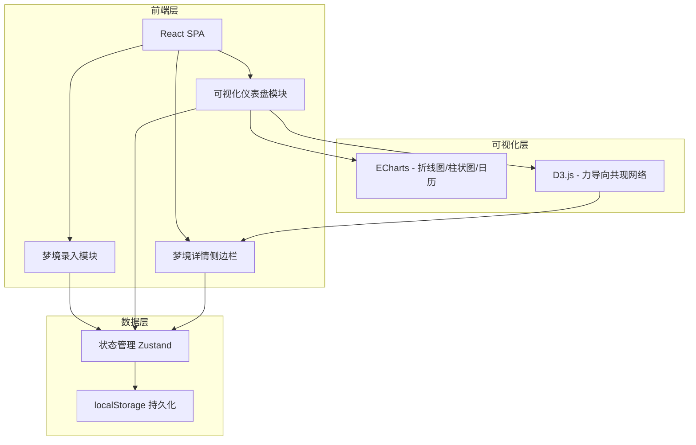
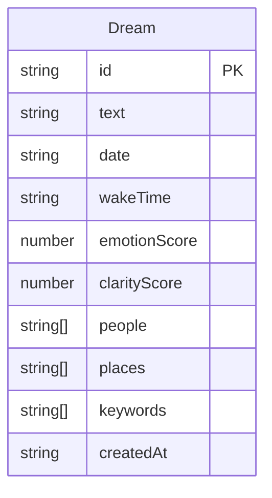

## 1. 架构设计



## 2. 技术说明

- **前端框架**：React@18 + TypeScript + Vite
- **初始化工具**：Vite (create-vite)
- **样式方案**：Tailwind CSS@3 + CSS Modules（毛玻璃等特殊效果）
- **状态管理**：Zustand（轻量、无boilerplate）
- **路由**：React Router@6（单页内切换录入/仪表盘视图）
- **图表库**：ECharts@5（情绪时间线、人物频率图、月份日历热力图）
- **网络图**：D3.js@7（关键词共现力导向图，需要精细交互控制）
- **数据持久化**：localStorage，通过 Zustand middleware 自动同步
- **后端**：无（纯前端应用）
- **字体**：Google Fonts - ZCOOL QingKe HuangYou + Noto Sans SC

## 3. 路由定义

| 路由 | 用途 |
|------|------|
| / | 仪表盘主页面（默认视图，含所有可视化图表） |
| /record | 梦境录入页面 |

仪表盘为默认首页，侧边栏通过交互触发滑出，非独立路由。

## 4. API定义

无后端API。数据通过 Zustand store + localStorage 直接在浏览器内读写。

### 数据操作接口（Zustand Store Actions）

```typescript
interface DreamStore {
  dreams: Dream[]
  selectedKeyword: string | null
  filteredDreams: Dream[]
  addDream: (dream: Omit<Dream, 'id' | 'createdAt'>) => void
  deleteDream: (id: string) => void
  selectKeyword: (keyword: string | null) => void
  getRecentTags: (type: 'people' | 'places' | 'keywords') => string[]
}
```

## 5. 服务器架构图

不适用（纯前端应用）

## 6. 数据模型

### 6.1 数据模型定义



### 6.2 数据定义

```typescript
interface Dream {
  id: string
  text: string
  date: string
  wakeTime: string
  emotionScore: number
  clarityScore: number
  people: string[]
  places: string[]
  keywords: string[]
  createdAt: string
}

interface CooccurrenceEdge {
  source: string
  target: string
  weight: number
}

interface CooccurrenceNode {
  id: string
  count: number
}
```

localStorage 键名：`dreamscope_dreams`

数据存储策略：
- 每次增删操作后自动序列化完整数组写入 localStorage
- 应用启动时从 localStorage 反序列化加载
- 无分页限制，梦境记录量预期在几百条以内
