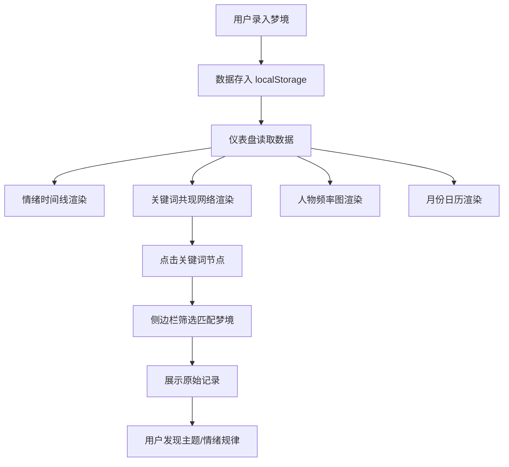

## 1. 产品概述

梦境档案（DreamScope）—— 一款纯前端的个人梦境可视化分析工具。用户每日录入梦境文本、醒来时间、情绪、清晰程度、人物、地点与关键词，系统将零散梦境转化为可交互的可视化图表，帮助用户发现长期重复出现的主题与情绪变化轨迹。所有数据保存在浏览器本地（localStorage），无需注册登录。

## 2. 核心功能

### 2.1 用户角色

无需角色区分，单一用户本地使用。

### 2.2 功能模块

1. **梦境录入页**：录入梦境文本、日期、醒来时间、情绪评分、清晰程度、出现的人物、地点、关键词标签
2. **可视化仪表盘**：情绪时间线、关键词共现网络、人物出现频率图、月份分布日历
3. **梦境详情侧边栏**：点击网络关键词联动筛选相关梦境，展示原始记录

### 2.3 页面详情

| 页面名称 | 模块名称 | 功能描述 |
|----------|----------|----------|
| 梦境录入 | 表单录入区 | 填写梦境文本（多行）、日期选择器、醒来时间选择、情绪评分（1-5星/滑块）、清晰程度（模糊→清晰滑块）、人物标签输入、地点标签输入、关键词标签输入 |
| 梦境录入 | 快捷标签 | 最近使用的标签快速选择，避免重复输入 |
| 仪表盘 | 情绪时间线 | 以折线图展示每日情绪评分随时间变化，支持hover查看详情 |
| 仪表盘 | 关键词共现网络 | 力导向图展示关键词节点，共现越多的关键词连线越粗，点击节点联动筛选梦境 |
| 仪表盘 | 人物出现频率图 | 横向柱状图展示人物出现次数排名 |
| 仪表盘 | 月份分布日历 | 日历热力图展示每月梦境记录密度，颜色深浅表示数量 |
| 梦境详情侧边栏 | 筛选列表 | 根据网络图选中的关键词筛选梦境，显示匹配的梦境卡片 |
| 梦境详情侧边栏 | 原始记录 | 展示梦境完整文本、元数据（时间、情绪、清晰度、标签等） |

## 3. 核心流程

用户打开应用后，首先在录入页记录梦境信息。随着记录积累，用户切换到仪表盘查看可视化图表。在关键词共现网络中点击某个关键词，侧边栏自动展开并显示包含该关键词的所有梦境记录，帮助用户追溯关联。

## 4. 用户界面设计

### 4.1 设计风格

- **主色调**：深靛蓝 (#0a0e27) 为底，梦境紫 (#7c3aed) 为主强调色，星光金 (#f0c040) 为辅助强调
- **次色调**：柔和蓝紫渐变用于图表，半透明毛玻璃效果用于卡片
- **按钮风格**：圆角胶囊形按钮，hover时微光效果
- **字体**：标题使用 ZCOOL QingKe HuangYou（站酷庆科黄油体），正文使用 Noto Sans SC
- **布局风格**：左侧导航 + 右侧主内容区，侧边栏从右侧滑出
- **图标风格**：线性图标配星空/月亮元素装饰
- **氛围**：星空背景 + 微弱粒子动画，营造夜梦氛围

### 4.2 页面设计概览

| 页面名称 | 模块名称 | UI元素 |
|----------|----------|--------|
| 梦境录入 | 表单录入区 | 毛玻璃卡片、深色输入框带微光边框、胶囊标签、星级评分组件、渐变滑块 |
| 梦境录入 | 快捷标签 | 横向滚动胶囊标签行，点击即选 |
| 仪表盘 | 情绪时间线 | 渐变折线图，数据点hover浮层，紫蓝渐变填充区域 |
| 仪表盘 | 关键词共现网络 | 力导向图，节点发光效果，连线粗细表示共现频率，选中节点高亮脉冲 |
| 仪表盘 | 人物出现频率图 | 横向柱状图，紫蓝渐变柱体，hover显示详情 |
| 仪表盘 | 月份分布日历 | 日历格子热力图，深浅紫蓝表示密度，hover显示日期梦境数量 |
| 梦境详情侧边栏 | 筛选列表 | 右侧滑出面板，毛玻璃背景，梦境卡片列表 |
| 梦境详情侧边栏 | 原始记录 | 卡片式展示，标签以小胶囊显示 |

### 4.3 响应式设计

桌面优先设计，确保1920px和1440px分辨率下最佳体验。平板端（768px-1024px）仪表盘改为2列布局，移动端侧边栏改为全屏覆盖。

### 4.4 3D场景指引

不适用
